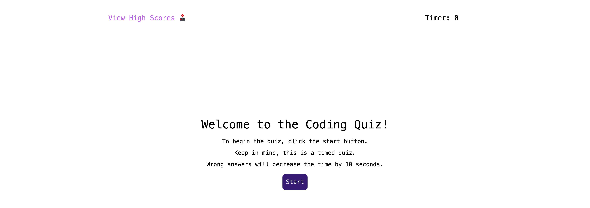
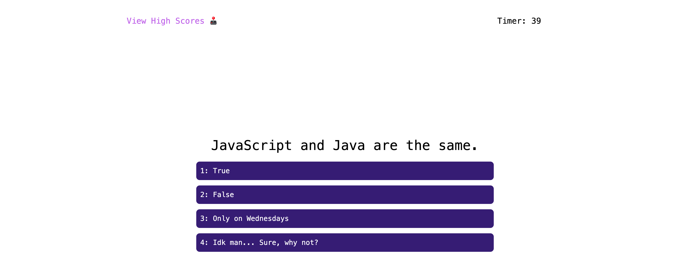
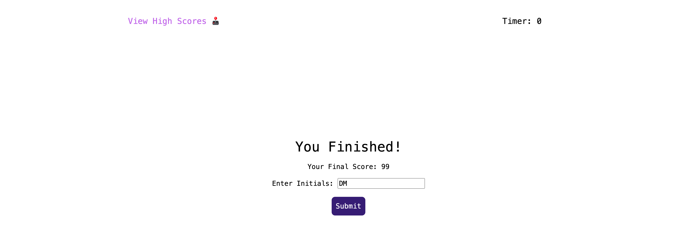
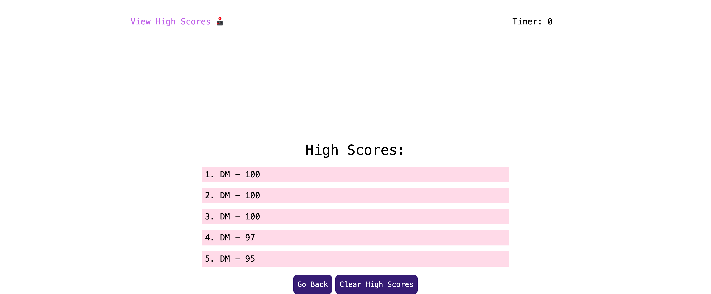

# Coding Quiz

## Description
This web app will quiz your understanding of JavaScript! Each correct answer gives you five points. Wrong answers will remove ten seconds from the timer. When you finish, you can save your score & add it to the list of high scores.

## Installation
This application is suitable with the most web browsers.

## Usage
Use this quiz app to test your JavaScript knowledge.

## Screenshots

#### Welcome

#### Quiz

#### Input Score 

#### High Scores 

## Credits
https://getbootstrap.com/docs/5.2/layout/grid/
 
https://codewithmosh.com/
 
https://developer.mozilla.org/en-US/docs/Web/API/setInterval
 
https://developer.mozilla.org/en-US/docs/Web/API/EventTarget/addEventListener?qs=addEve
 
https://developer.mozilla.org/en-US/docs/Web/API/Document

## License
Please refer to LICENSE file in Repo.

## Deployment
https://davidmackeydev.github.io/coding-quiz